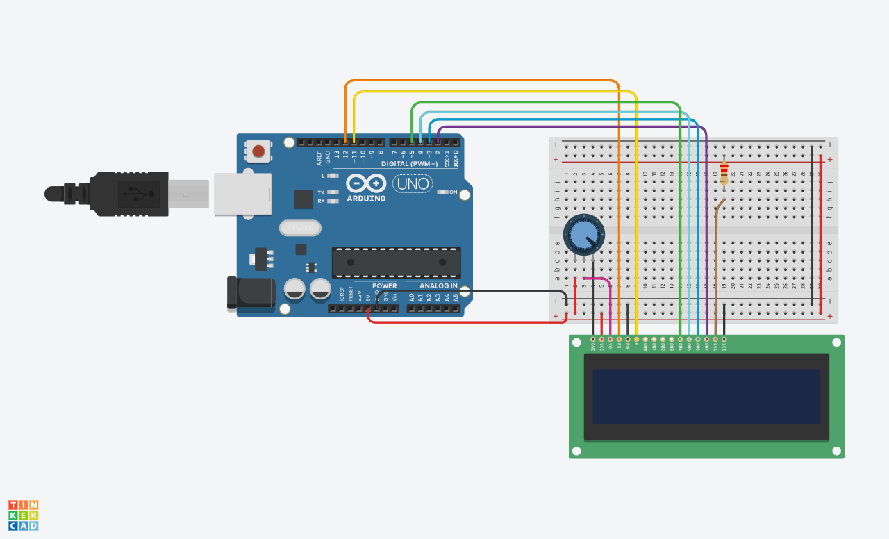

# LCD-LED-Control

Este projeto é um exercício prático para um curso de microcontroladores, que ensina os conceitos básicos de controle de LCD e LED usando Arduino. O código usa um display LCD de 16x2 para mostrar texto e números, e botões para ajustar o brilho de um LED. O nível de brilho atual também é mostrado no LCD. O código é escrito em linguagem Arduino, que é uma versão simplificada de C++ para microcontroladores.

## Requisitos

Para executar este projeto, você precisa de:

- Um Arduino Uno ou compatível
- Um display LCD de 16x2 com módulo I2C
- Um LED
- Dois botões
- Um resistor de 220 ohms
- Um potenciômetro de 10k ohms
- Cabos jumper

## Código

O código fonte do projeto está na pasta `src`, no arquivo `LCD-LED-Control.ino`. Você pode abrir esse arquivo com a IDE do Arduino e fazer o upload para o seu Arduino. O código está comentado para explicar cada parte da lógica.

## Imagens

Esquema do projeto.

Imagem do projeto montado em uma protoboard.

## Licença

Este projeto está licenciado sob a licença MIT. Veja o arquivo [LICENSE](LICENSE) para mais detalhes.